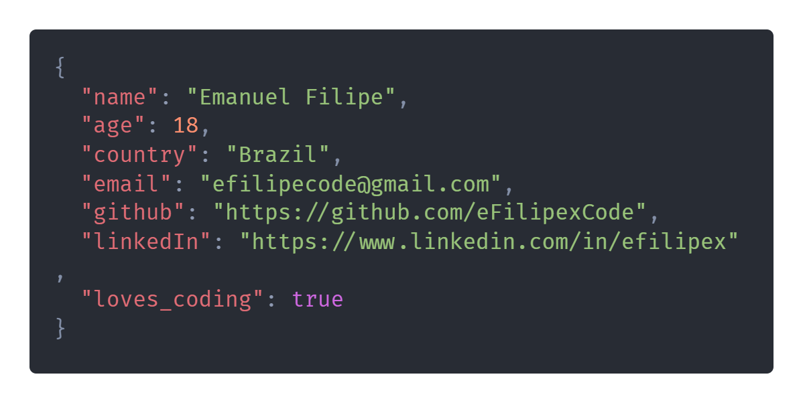

# Hello there!

### Who's efilipex? 🤔
Hello! Glad you're here 😁! I'm Emanuel Filipe - or also called [efilipex](https://efilipex.netlify.app/) - and I'm a frontend development student, seeking new knowledges and skills! I'm currently learning ReactJs, React Native, Node, Svelte, Typescript.

  

